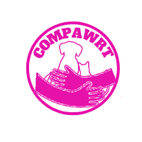
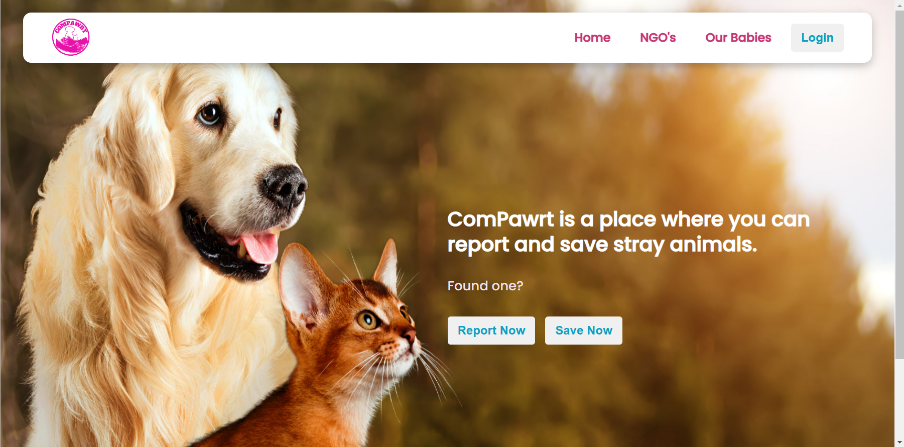
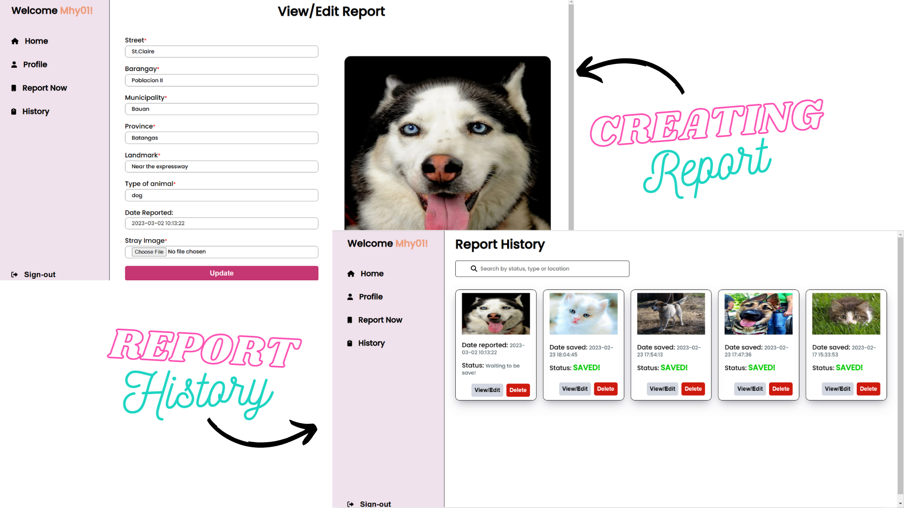
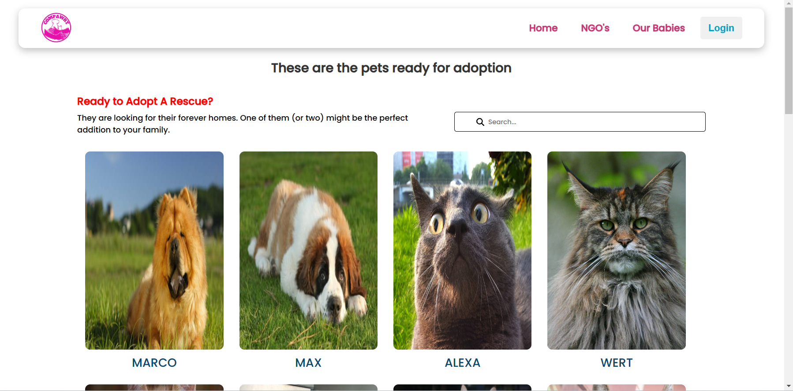

# Compawrt

Compawrt is a web application that makes it easier for concerned citizens to report found stray animals and for organizations that cater these animals welfare to easily save them.


## Screenshots

### Landing Page



### Citizen User Dashboard



### Our Babies Page




## Features

- User authentication: Users can create an account, log in, and log out.
- Search: Users can search for strays or pets by name, location or type.
- Profile Page: users can view and update their personal informations.
- Report and History tab (for citizen users): Users can create, edit or delete his/her reports of the stray animals found.
- Save Me (for org-member users): All citizen users reports that are not yet saved will appear and they can update the status if it was saved.
- Post Your Pet and History tab (for org-member users): Users can post their pets that are ready for adoption, as well as, edit and delete them.
- Our Babies page: Displays all the pets posted for adoption and an adoption inquiry through email messaging.


## Tech Stack

**Client:** 
- [React Vite](https://vitejs.dev)
- [HTML 5](https://developer.mozilla.org/en-US/docs/Web/HTML)
- [CSS 3](https://developer.mozilla.org/en-US/docs/Web/CSS)
- [Javascript](https://developer.mozilla.org/en-US/docs/Web/javascript)
- [Font Awesome](https://fontawesome.com/v6/docs/web/use-with/react/)
- [React Toastify](https://fkhadra.github.io/react-toastify/introduction/)
- [EmailJS](https://www.emailjs.com/)

**Server:**
- [NodeJS](https://nodejs.org/en/)
- [Express](http://expressjs.com/)
- [bcryptjs](https://www.npmjs.com/package/bcryptjs)
- [CORS](https://www.npmjs.com/package/cors)
- [dotenv](https://www.npmjs.com/package/dotenv)
- [jsonwebtoken](https://www.npmjs.com/package/jsonwebtoken)
- [Multer](https://www.npmjs.com/package/multer)
- [Nodemon](https://www.npmjs.com/package/nodemon)

(See package.json for more libraries used)

**Image Storage:**
- [Cloudinary](https://cloudinary.com/)

**Database Management System:**
- [PostgreSQL](https://www.postgresql.org/)


## Database Setup

1. Install [PostgreSQL](https://www.enterprisedb.com/downloads/postgres-postgresql-downloads) if it not yet installed in your local computer.
2. Setup new database instance:
    - Open SQL shell.
    - Login to your database.
    - Open the 'capstone_project.sql' file.
    - Copy and paste `CREATE DATABASE <your database name>;` into the command line of SQL shell.
    - After creating the database, type `\c <your database name>` (without the `< >`) into the command line.
    - Execute commands from file by typing `\i <...path to file/capstone_project.sql>`. Note that when executing this command in Windows, single quotes should be added like   this `\i '<...path to file/capstone_project.sql>'`
    - (Optional, if the steps above doesn't work) Individually copy all the CREATE TABLE statements from the 'capstone_project.sql' file into the command line to create your tables.


## Cloudinary Setup

1. Sign up for a free account at [cloudinary.com](https://cloudinary.com/).
2. Once you've signed up, create a new Cloudinary project and obtain your API credentials (cloud name, API key, and API secret). You can find these credentials in your account dashboard.


## Installation

To run the app locally, follow these steps:

1. Clone the repository.
```bash
  git clone https://github.com/mhy2501/compawrt.git
```
2. Navigate to the project server directory.
```bash
  cd server
```
3. Install all the dependencies for the server.
```bash
  npm install
```
4. Connect the database to the server.
   - In `pool.js` file, update
   ```bash
   user: '<your postgre username>',
   password: '<your postgre password>',
   host: '<localhost>', (localhost if not changed)
   port: '<port>', (5432 if not changed)
   database: '<your database name>'
   ```
   
5. Create `.env` variable and type the following:
   - `jwtSecret = <your password-like string here>`
   - `FRONTEND_URL = http://localhost:<your client local/port>`
   - `CLOUDINARY_CLOUD_NAME = <your cloudinary name from your cloudinary account dashboard>`
   - `CLOUDINARY_API_KEY = <your API key from your cloudinary account dashboard>`
   - `CLOUDINARY_API_SECRET = <your API secret from your cloudinary account dashboard>`

6. Open a new terminal and navigate to the client directory.
```bash
  cd frontend
```
7. Install all the dependencies for the client.

8. Create `.env` file and type
   - `VITE_API = http://localhost:8000`
   
9. Start the server
```bash
  npm run start
```

10. Start the client

```bash
  npm run dev
```


## External Links

1. Compassion and Responsibility for Animals (CARA) Website - [https://www.caraphil.org/](https://www.caraphil.org/)
2. People for the Ethical Treatment of Animals (PETA) Website - [https://www.petaasia.com/](https://www.petaasia.com/)
3. Animal Kingdom Foundation (AKF) Website - [https://akf.org.ph/](https://akf.org.ph/)
4. Pawssion Project Website - [https://pawssionproject.org.ph/](https://pawssionproject.org.ph/)
5. Philippine Animal Rescue Team (PART) Website - [http://www.philanimalrescue.org/](http://www.philanimalrescue.org/)
6. Philippine Animal Welfare Society (PAWS) Website - [https://paws.org.ph/](https://paws.org.ph/)


